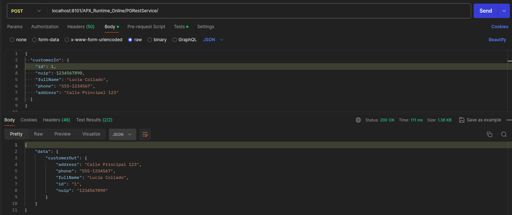
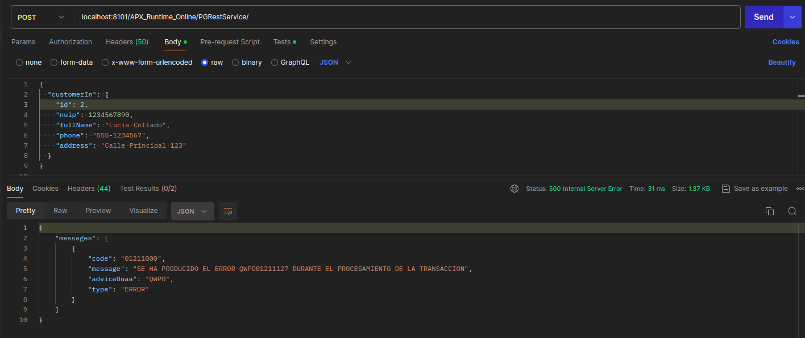
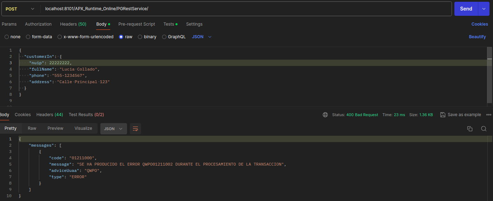
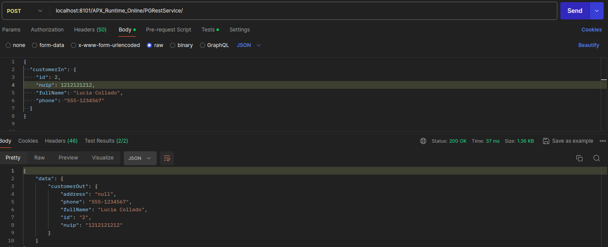

# PRUEBA TÉCNICA APX

Nos enfrentamos al desafío de almacenar la información de un cliente en una base de datos Oracle mediante un proceso de inserción.

### Restricciones

- El nombre de la tabla debe estar dentro del esquema **WIKJ** y debe tener el nombre **T_WIKJ_HAB_PRUEBAFINAL**

- Se debe validar antes de hacer la inserción de la información que el **nuip** no exista previamente

- Creación de la tabla:

    ```
    CREATE TABLE WIKJ."T_WIKJ_HAB_PRUEBAFINAL"(
	    id Number(5) NOT NULL PRIMARY KEY,
	    nuip Number(10) UNIQUE,
	    full_name VARCHAR(50),
	    phone VARCHAR(15),
	    address VARCHAR(30)
    )
*Debido a que hay que validar que el **nuip** no exista previamente, en la creación de la tabla, se añade el UNIQUE constraint.
Así, se evitarán duplicados.*

### USO
- **POST -> localhost:8101/APX_Runtime_Online/PGRestService/**
- **logical-transaction-code -> WIKJT001**

### RESULTADOS

#### ENTRADA DATOS OK



-  La salida refleja la misma información proporcionada como entrada, ya que dicha es correcta.


#### NUIP DUPLICADO



- Se recibe un error al intentar insertar los datos del cliente con el mismo **nuip**.

    ```
    QWPO01211127 -> DBException 

    -> Runtime logs:
    Updating with SQL: INSERT INTO WIKJ.T_WIKJ_HAB_PRUEBAFINAL (id, nuip, full_name, phone, address) VALUES (:id, :nuip, :full_name, :phone, :address)

    Error in JDBC access in method update.
    com.bbva.apx.exception.db.DuplicateKeyException: DuplicateKey Error in update with SQL[TypeDB:] - [DB:]
#### Otras pruebas:

- No añadir el campo **id** (campo obligatorio) en la entrada de datos:



    QWPO01211002 -> CAMPO OBLIGATORIO $115$ NO INFORMADO -> Se ha definido un campo obligatorio para la ejecución de la transacción y no se ha especificado

- No añadir algún dato no obligatorio 



    