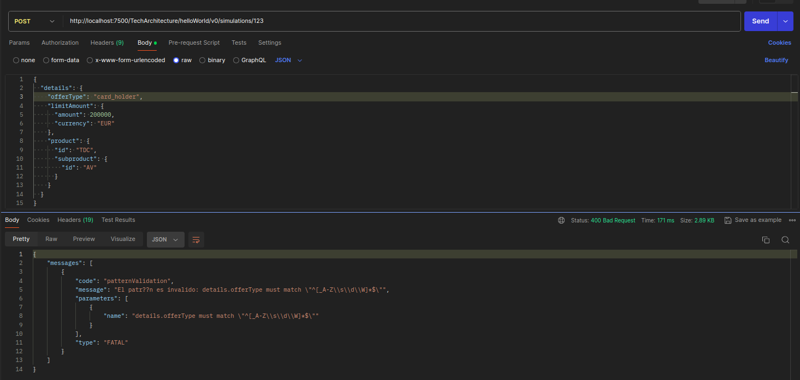
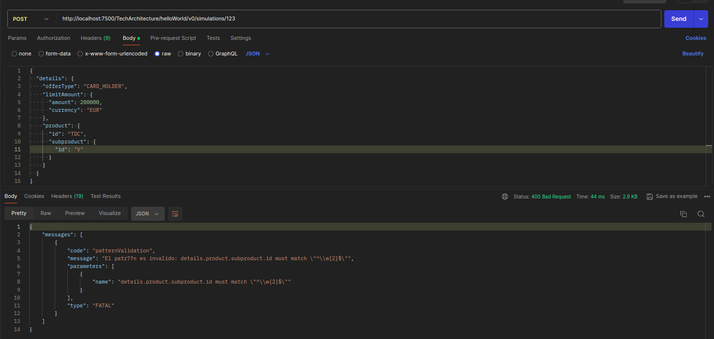

# PRUEBA TÉCNICA ASO
El objetivo principal es gestionar simulaciones de contrataciones de tarjetas de crédito para un cliente a través de un servicio que acepta peticiones POST con datos en formato JSON.

#### Request del servicio ASO.

PathParam: http://localhost:7500/TechArchitecture/helloWorld/v0/simulations/{nuip}

### VALIDACIONES

- Se introduce un offertype en minúsculas:

- No se introduce un **amount**

- Se introduce un **currency** vacía

- Se introduce un **id** de producto diferente a **"TDC"**

- Se introduce un **id** de subproducto con un tamaño diferente a 2 caracteres
